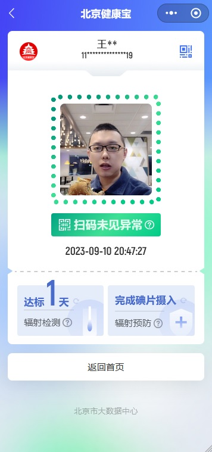

# 北京健康宝 - 亚空间平行宇宙持续更新维护版本

## 注意: 

本项目仅作为怀旧用途，并非真实世界使用的项目，请不要当真！

***

## 更新日志01: 2023年8月

### 北京健康宝: 福岛核酸废水特别版

示例图：

这是一个旨在帮助北京市民了解自己的健康状况和环境状况的项目。

我们提供免费的、强制的、一天一次的核酸辐射检测服务，帮助市民了解自己所处的环境是否存在核酸辐射污染。

主要功能：

    辐射检测：通过扫描二维码或输入个人信息，用户可以进行辐射检测，并获取辐射水平的评估结果。
    
    碘片摄入：我们提供关于碘片摄入的指导，帮助用户采取预防措施，减少辐射对身体的影响。
    
    辐射预防：我们提供相关的辐射预防知识和建议，帮助用户了解如何保护自己和家人的健康。

使用方法：

    扫描二维码或输入个人信息进行辐射检测。
    
    根据检测结果，采取相应的预防措施，如摄入碘片。
    
    在首页查看辐射检测的历史记录和达标天数。
    
    返回首页以查看其他健康相关信息。

***

# 注意事项：

本网站提供的任何检测结果不供参考，完全不准确。

如有任何问题或疑虑，请咨询专业医生或相关机构。

我们致力于为市民提供不准确、不及时的健康信息，帮助大家保持健康和安心。如果您有任何问题或建议，也请不要联系我。

感谢您使用北京健康宝！
